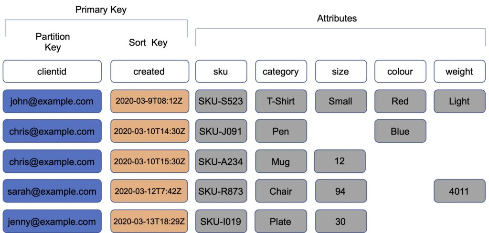
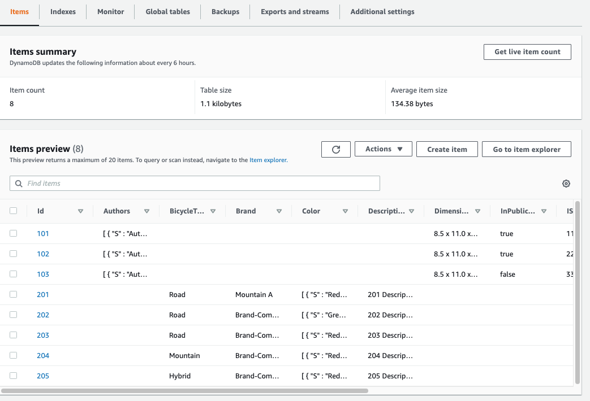
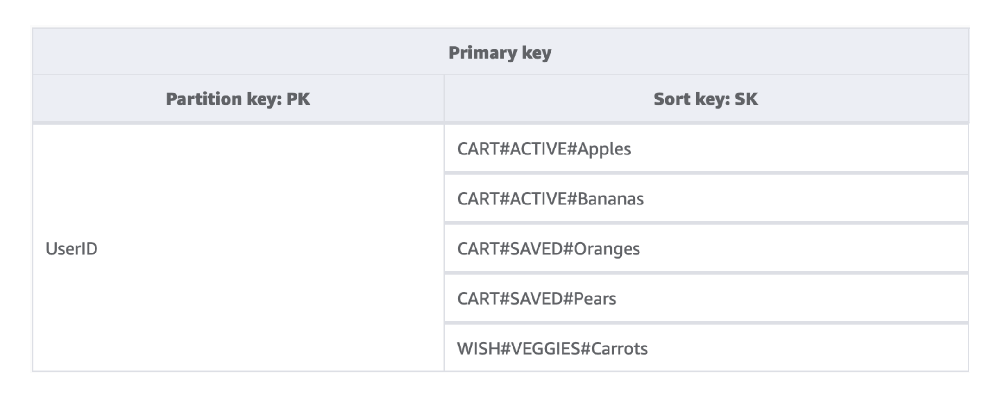

# dynamodb-repository-pattern

Implementing repository pattern for working with DynamoDB and Zod

## The Repository pattern

> Have thing that handle persistence

SOLID
- Single Responsibility
- Dependency Inversion

```
public interface IRepository<T> where T : EntityBase
{
    T GetById(int id);
    IEnumerable<T> List();
    IEnumerable<T> List(Expression<Func<T, bool>> predicate);
    void Add(T entity);
    void Delete(T entity);
    void Edit(T entity);
}

public abstract class EntityBase
{
   public int Id { get; protected set; }
}
```

## DynamoDB as a Key-Value store

Each item has a `primary key` made up of a `partition key (pk)` and a `sort key (sk)`. Each item can then have many attributes.



## Items are not bound to a certain set of attributes

Items can have any attributes, provided the maintain a `primary key`



## DynamoDB doesn't "speak" JSON directly

Data needs to be "marshalled" and "unmarshalled" 

```
{
    "ForumName": {"S": "Amazon DynamoDB"},
    "Subject": {"S": "New discussion thread"},
    "Message": {"S": "First post in this thread"},
    "LastPostedBy": {"S": "fred@example.com"},
    "ViewedCount": {"N": "200"},
    "Settings": { 
      "M": {
        "IsPublic": { "B": "false" }
      }
    }
}
```

## There are lots of options for libraries to work with DynamoDB -- they all suck

### DynamoDB Data Mapper

https://github.com/awslabs/dynamodb-data-mapper-js

RIP -- since archived


```js
import {
    attribute,
    hashKey,
    rangeKey,
    table,
} from '@aws/dynamodb-data-mapper-annotations';

@table('table_name')
class MyDomainObject {
    @hashKey()
    id: string;

    @rangeKey({defaultProvider: () => new Date()})
    createdAt: Date;

    @attribute()
    completed?: boolean;
}
```

Usage

```
const thing = new MyDomainObject()

await mapper.put(thing)
```

Working with class-based domain objects -- nyeh...

### OneTable 

https://github.com/sensedeep/dynamodb-onetable

```js
import {DynamoDBClient} from '@aws-sdk/client-dynamodb'
const client = new DynamoDBClient(params)

const MySchema = {
    format: 'onetable:1.1.0',
    version: '0.0.1',
    indexes: {
        primary: {hash: 'pk', sort: 'sk'},
        gs1: {hash: 'gs1pk', sort: 'gs1sk', follow: true},
        ls1: {sort: 'id', type: 'local'},
    },
    models: {
        Account: {
            pk: {type: String, value: 'account:${id}'},
            sk: {type: String, value: 'account:'},
            id: {type: String, generate: 'ulid', validate: /^[0123456789ABCDEFGHJKMNPQRSTVWXYZ]{26}$/i},
            name: {type: String, required: true},
            status: {type: String, default: 'active'},
            zip: {type: String},
        },
        User: {
            pk: {type: String, value: 'account:${accountName}'},
            sk: {type: String, value: 'user:${email}', validate: EmailRegExp},
            id: {type: String, required: true},
            accountName: {type: String, required: true},
            email: {type: String, required: true},
            firstName: {type: String, required: true},
            lastName: {type: String, required: true},
            username: {type: String, required: true},
            role: {type: String, enum: ['user', 'admin'], required: true, default: 'user'},
            balance: {type: Number, default: 0},

            gs1pk: {type: String, value: 'user-email:${email}'},
            gs1sk: {type: String, value: 'user:'},
        },
    },
    params: {
        isoDates: true,
        timestamps: true,
    },
}

const table = new Table({
    client: client,
    name: 'MyTable',
    schema: MySchema,
})
```
To create an item:

```js
let account = await Account.create({
    id: '8e7bbe6a-4afc-4117-9218-67081afc935b',
    name: 'Acme Airplanes',
})
```

This will write the following to DynamoDB:

```js
{
    pk:         'account:8e7bbe6a-4afc-4117-9218-67081afc935b',
    sk:         'account:98034',
    id:         '8e7bbe6a-4afc-4117-9218-67081afc935b',
    name:       'Acme Airplanes',
    status:     'active',
    zip:        '98034',
    created:    1610347305510,
    updated:    1610347305510,
}
```

Get an item:

```js
let account = await Account.get({
    id: '8e7bbe6a-4afc-4117-9218-67081afc935b',
})
```

which will return:

```js
{
    id:       '8e7bbe6a-4afc-4117-9218-67081afc935b',
    name:     'Acme Airplanes',
    status:   'active',
    zip:      '98034',
}
```

There is a lot going on. Opinionated, wants to manage tables

### DynamoDBDocument

Part of AWS SDK v3

https://github.com/aws/aws-sdk-js-v3/tree/main/lib/lib-dynamodb

```js
import { DynamoDBDocument } from "@aws-sdk/lib-dynamodb";

// ... DynamoDB client creation

const ddbDocClient = DynamoDBDocument.from(client);
// Call using full client.
await ddbDocClient.put({
  TableName,
  Item: {
    id: "2",
    content: "content from DynamoDBDocument",
  },
});
```

## Code stuff!


## Single Table stuff

Basically just creative use of the sort key

